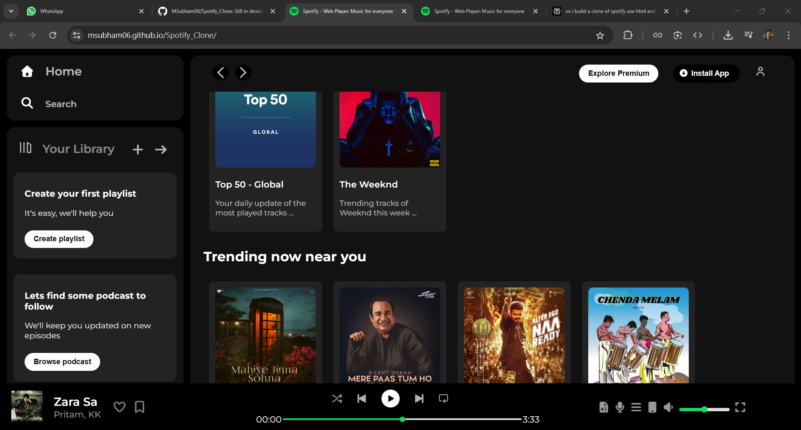
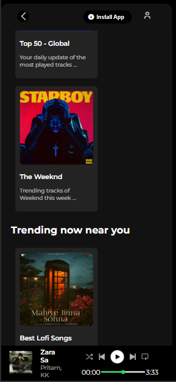

#  Spotify Clone - Web Player

<div align="center">
  
  
  
  
  
  
  **A pixel-perfect Spotify UI clone built with pure HTML & CSS**
  
   • [Features](#-features) • [Getting Started](#-getting-started) • [Screenshots](#-screenshots)
  
</div>

---

## 📖 Table of Contents

- [About The Project](#-about-the-project)
- [Features](#-features)
- [Built With](#️-built-with)
- [Screenshots](#-screenshots)
- [Folder Structure](#-folder-structure)
- [Getting Started](#-getting-started)
  - [Prerequisites](#prerequisites)
  - [Installation](#installation)
- [What I Learned](#-what-i-learned)
- [Challenges Faced](#-challenges-faced)
- [Future Enhancements](#-future-enhancements)
- [Contributing](#-contributing)
- [License](#-license)
- [Contact](#-contact)
- [Acknowledgments](#-acknowledgments)

---

## 🎯 About The Project

This is a **Spotify Web Player Clone** that replicates the visual design and layout of Spotify's web interface. Built as a mini-project during my Full Stack Development journey in the **Sigma Batch by Apna College**, this project showcases fundamental HTML and CSS skills without any backend functionality or AI assistance.

### 🎓 Learning Context

- **Course**: Full Stack Web Development - Sigma Batch
- **Institution**: Apna College
- **Focus**: HTML5 & CSS3 Fundamentals
- **Development Approach**: Hand-coded without framework dependencies
- **AI Usage**: Minimal (3-4 queries for loader functionality only)

### 💡 Project Motivation

The goal was to:
- ✅ Apply HTML & CSS concepts learned in the course
- ✅ Practice responsive design principles
- ✅ Recreate a production-grade UI from scratch
- ✅ Build pixel-perfect layouts using Flexbox
- ✅ Understand complex UI component structures

---

## 🎬 Demo

> **Note**: This is a UI-only clone. No audio playback or interactive features are implemented (no JavaScript functionality except for the loading animation).

---

## ✨ Features

### 🎨 **UI Components**

| Component | Description |
|-----------|-------------|
| **Sidebar Navigation** | Home, Search, and Your Library sections |
| **Library Section** | Create Playlist & Browse Podcasts cards |
| **Sticky Navigation** | Backward/Forward navigation with user profile |
| **Content Cards** | Recently Played, Trending, and Featured Charts |
| **Music Player** | Bottom fixed player with album info and controls |
| **Custom Loading Screen** | Animated Spotify logo loader |
| **Responsive Design** | Mobile-friendly layout (breakpoints at 420px, 600px, 800px, 1000px, 1150px) |

### 🎨 **Design Features**

- ✅ **Pixel-Perfect Styling** - Matches Spotify's design language
- ✅ **Custom Scrollbars** - Styled to blend seamlessly
- ✅ **Hover Effects** - Interactive visual feedback
- ✅ **Progress Bars** - Custom-styled range inputs for playback/volume
- ✅ **Font Integration** - Montserrat & Poppins from Google Fonts
- ✅ **Icon Library** - Font Awesome 7.0.1 integration
- ✅ **Dark Theme** - True-to-original Spotify black theme

---

## 🛠️ Built With

<table>
  <tr>
    <td align="center" width="150">
      
      <br><b>HTML5</b>
    </td>
    <td align="center" width="150">
      
      <br><b>CSS3</b>
    </td>
    <td align="center" width="150">
      
      <br><b>JavaScript</b><br>(Loader only)
    </td>
  </tr>
</table>

### **Technologies & Libraries**

- **HTML5** - Semantic markup structure
- **CSS3** - Flexbox, custom properties, animations
- **JavaScript** - Minimal (page loader only)
- **Font Awesome 7.0.1** - Icon library
- **Google Fonts** - Montserrat & Poppins

---

## 📸 Screenshots

### 🖥️ Desktop View



### 📱 Mobile View (< 600px)



## 📂 Folder Structure

```
spotify-clone/
│
├── index.html              # Main HTML file
├── style.css               # All styling (1000+ lines)
├── README.md               # Project documentation
│
└── assets/                 # Image assets
    ├── logo.png           # Spotify logo
    ├── backward_icon.png  # Navigation icons
    ├── forward_icon.png
    ├── library_icon.png
    ├── player_icon1.png   # Player control icons
    ├── player_icon2.png
    ├── player_icon3.png
    ├── player_icon4.png
    ├── player_icon5.png
    ├── card1img.jpeg      # Playlist card images
    ├── card2img.jpeg
    ├── card3img.jpeg
    ├── card4img.jpeg
    ├── card5img.jpeg
    ├── card6img.jpeg
    ├── card7img.jpg       # Album cover (music player)
    ├── card8img.jpg
    ├── card9img.png
    └── card10img.png
```


## 📚 What I Learned

Building this project reinforced several key concepts:

### HTML5 Concepts
- ✅ Semantic HTML structure (`<nav>`, `<section>`, `<footer>`)
- ✅ Proper meta tags for viewport and charset
- ✅ External resource linking (fonts, icons, stylesheets)
- ✅ Organizing complex nested structures
- ✅ Accessibility considerations (alt texts, labels)

### CSS3 Techniques
- ✅ **Flexbox Mastery** - Building complex layouts without Grid
- ✅ **Custom Properties** - CSS variables for theme consistency
- ✅ **Pseudo-classes** - `:hover`, `:focus`, `:active` states
- ✅ **Media Queries** - Responsive breakpoints (420px to 1150px)
- ✅ **Custom Styling** - Range inputs, scrollbars, and progress bars
- ✅ **CSS Animations** - Fade pulse effect for loader
- ✅ **Positioning** - `sticky`, `fixed`, `relative`, `absolute`
- ✅ **Overflow Management** - Custom scrollbar styling
- ✅ **Gradient Backgrounds** - Linear gradients for progress indicators

### JavaScript Basics
- ✅ Window event listeners (`load` event)
- ✅ DOM manipulation (class toggling)
- ✅ setTimeout for delayed actions
- ✅ Basic animation timing

### Design Principles
- ✅ **Visual Hierarchy** - Using size, color, and spacing
- ✅ **Consistency** - Maintaining design patterns throughout
- ✅ **Whitespace** - Proper spacing for readability
- ✅ **Color Theory** - Dark theme implementation
- ✅ **Typography** - Font pairing and sizing
- ✅ **User Experience** - Hover states and visual feedback

---

## 🏔️ Challenges Faced

Building this clone presented several learning opportunities:

### 1. **Responsive Sidebar**
**Challenge**: Making sidebar disappear on mobile while keeping content accessible.

**Solution**: Used `@media (max-width: 600px)` to hide sidebar with `display: none`.

### 2. **Custom Range Inputs**
**Challenge**: Styling the progress bar and volume slider to match Spotify's design.

**Solution**: Used `-webkit-slider-thumb` and `-webkit-slider-runnable-track` pseudo-elements with custom gradients.

```css
.progress-bar::-webkit-slider-thumb {
  appearance: none;
  width: 0.6rem;
  height: 0.6rem;
  border-radius: 50%;
  background-color: #1bd760;
}
```

### 3. **Sticky Navigation**
**Challenge**: Keeping navigation visible while scrolling through playlists.

**Solution**: Implemented `position: sticky; top: 0;` with proper z-index layering.

### 4. **Loading Animation**
**Challenge**: Creating smooth fade-in effect for page content.

**Solution**: CSS opacity transitions combined with JavaScript event listeners:

```javascript
window.addEventListener('load', () => {
  const loader = document.getElementById('loader');
  loader.classList.add('hidden');
  setTimeout(() => loader.remove(), 600);
});
```

### 5. **Multiple Breakpoints**
**Challenge**: Managing layout across 5+ different screen sizes.

**Solution**: Strategic media queries at 420px, 600px, 800px, 1000px, and 1150px with conditional displays.

---

## 🔮 Future Enhancements

While this is currently a UI-only clone, potential improvements include:

### Phase 1 - Interactivity (JavaScript)
- [ ] Add play/pause functionality
- [ ] Implement working progress bar (seek functionality)
- [ ] Volume control slider
- [ ] Search functionality with filtering
- [ ] Card click navigation
- [ ] Dynamic playlist loading

### Phase 2 - Backend Integration
- [ ] Connect to Spotify Web API
- [ ] User authentication (OAuth)
- [ ] Fetch real playlist data
- [ ] Stream audio tracks
- [ ] Save user preferences
- [ ] Create custom playlists

### Phase 3 - Advanced Features
- [ ] Dark/Light theme toggle
- [ ] Keyboard shortcuts
- [ ] Lyrics display
- [ ] Queue management
- [ ] Share functionality
- [ ] Offline mode (PWA)

### Phase 4 - Performance
- [ ] Lazy loading for images
- [ ] Code splitting
- [ ] Service Worker implementation
- [ ] Accessibility improvements (ARIA labels)

---


## 📄 License

This project is for **educational purposes only**. It is not affiliated with or endorsed by Spotify.

- The Spotify name, logo, and design are trademarks of **Spotify AB**.
- This project is created purely for learning HTML/CSS and portfolio demonstration.
- Not intended for commercial use or distribution.

**MIT License** - You're free to use this code for learning and personal projects.

---

</div>
